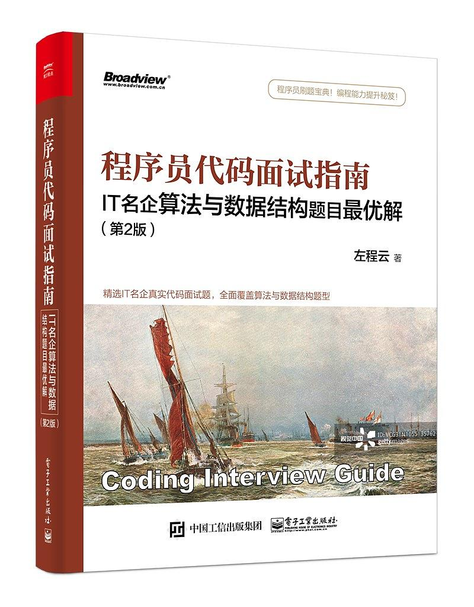

## 《程序员代码面试指南—IT名企算法与数据结构题目最优解》题解与反思

#### [栈和队列](https://github.com/JIANGLY33/CodingInterviewGuideProblemSet/tree/master/src/main/java/StackAndQueue)

[设计一个有getMin功能的栈](https://github.com/JIANGLY33/CodingInterviewGuideProblemSet/tree/master/src/main/java/StackAndQueue/getMinStack)（参考难度:⭐  提供解法: 💧💧）

[由两个栈组成的队列](https://github.com/JIANGLY33/CodingInterviewGuideProblemSet/tree/master/src/main/java/StackAndQueue/TwoStacksQueue)（参考难度:⭐⭐  提供解法: 💧）

[如何仅用递归函数和栈操作逆序一个栈](https://github.com/JIANGLY33/CodingInterviewGuideProblemSet/tree/master/src/main/java/StackAndQueue/RecursionReverseStack)（参考难度:⭐⭐  提供解法: 💧）

[猫狗队列](https://github.com/JIANGLY33/CodingInterviewGuideProblemSet/tree/master/src/main/java/StackAndQueue/CatDogQueue)（参考难度:⭐  提供解法: 💧💧）

[用一个栈实现另一个栈的排序](https://github.com/JIANGLY33/CodingInterviewGuideProblemSet/tree/master/src/main/java/StackAndQueue/SortStackByStack)（参考难度:⭐  提供解法: 💧）

[用栈来求解汉诺塔问题](https://github.com/JIANGLY33/CodingInterviewGuideProblemSet/tree/master/src/main/java/StackAndQueue/HanoiProblem)（参考难度:⭐⭐⭐  提供解法: 💧💧）

[生成窗口最大值数组](https://github.com/JIANGLY33/CodingInterviewGuideProblemSet/tree/master/src/main/java/StackAndQueue/MaxWindowArray)（参考难度:⭐⭐  提供解法: 💧💧）

[单调栈结构](https://github.com/JIANGLY33/CodingInterviewGuideProblemSet/tree/master/src/main/java/StackAndQueue/MonotonicStack)（参考难度:⭐⭐+⭐⭐  提供解法: 💧+💧）

[求最大子矩阵的大小](https://github.com/JIANGLY33/CodingInterviewGuideProblemSet/tree/master/src/main/java/StackAndQueue/MaxSquareMatrix)（参考难度:⭐⭐⭐  提供解法: 💧）

[最大值减去最小值小于等于num的子数组数量](https://github.com/JIANGLY33/CodingInterviewGuideProblemSet/tree/master/src/main/java/StackAndQueue/MaxMinusMinArray)（参考难度:⭐⭐⭐  提供解法: 💧）

[可见的山峰对数量](https://github.com/JIANGLY33/CodingInterviewGuideProblemSet/tree/master/src/main/java/StackAndQueue/VisibleMountains)（参考难度:⭐+⭐⭐⭐⭐  提供解法: 💧+💧）

#### [链表问题](https://github.com/JIANGLY33/CodingInterviewGuideProblemSet/tree/master/src/main/java/Linkedlist)

[打印两个有序链表的公共部分](https://github.com/JIANGLY33/CodingInterviewGuideProblemSet/tree/master/src/main/java/Linkedlist/PrintPublic)（参考难度:⭐  提供解法: 💧）

[在单链表和双链表中删除倒数第K个节点](https://github.com/JIANGLY33/CodingInterviewGuideProblemSet/tree/master/src/main/java/Linkedlist/RemoveLastKthNode)（参考难度:⭐  提供解法: 💧）

[删除链表的中间节点和a/b处的节点](https://github.com/JIANGLY33/CodingInterviewGuideProblemSet/tree/master/src/main/java/Linkedlist/DeleteMidNode)（参考难度:⭐+⭐  提供解法: 💧+💧）

[反转单向和双向链表](https://github.com/JIANGLY33/CodingInterviewGuideProblemSet/tree/master/src/main/java/Linkedlist/ReverseLinkedList)（参考难度:⭐  提供解法: 💧）

[反转部分单向链表](https://github.com/JIANGLY33/CodingInterviewGuideProblemSet/tree/master/src/main/java/Linkedlist/ReversePartialLinkedList)（参考难度:⭐  提供解法: 💧）

[环形单链表的约瑟夫问题](https://github.com/JIANGLY33/CodingInterviewGuideProblemSet/tree/master/src/main/java/Linkedlist/JosephusProblem)（参考难度:⭐+ ⭐⭐⭐ 提供解法: 💧+💧）

[判断一个链表是否为回文结构](https://github.com/JIANGLY33/CodingInterviewGuideProblemSet/tree/master/src/main/java/Linkedlist/JudgePalindrome)（参考难度:⭐+ ⭐⭐ 提供解法: 💧💧+💧）

[将单向链表按某值划分成左边小、中间相等、右边大的形式](https://github.com/JIANGLY33/CodingInterviewGuideProblemSet/tree/master/src/main/java/Linkedlist/DivideLinkedList)（参考难度:⭐+ ⭐⭐ 提供解法: 💧+💧）

[复制含有随机指针节点的链表](https://github.com/JIANGLY33/CodingInterviewGuideProblemSet/tree/master/src/main/java/Linkedlist/CopyRandomNode)（参考难度:⭐⭐+⭐⭐  提供解法: 💧+💧）

[两个单链表生成相加链表](https://github.com/JIANGLY33/CodingInterviewGuideProblemSet/tree/master/src/main/java/Linkedlist/AddTwoLinkedLists)（参考难度:⭐ 提供解法: 💧💧💧）

持续更新……

